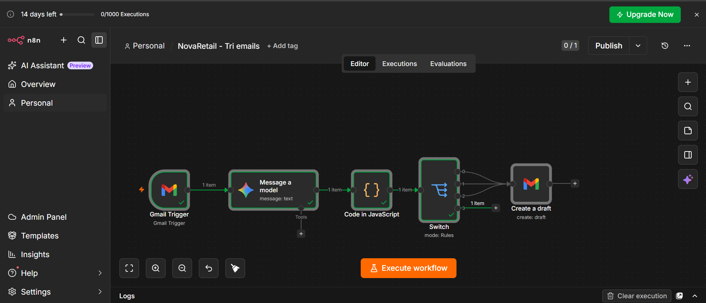
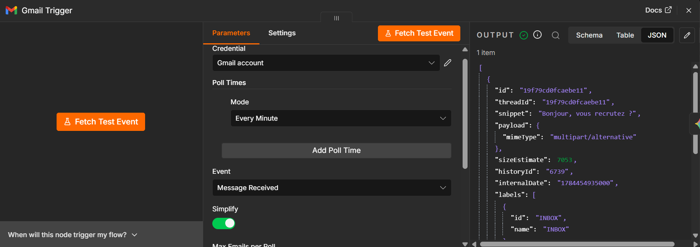
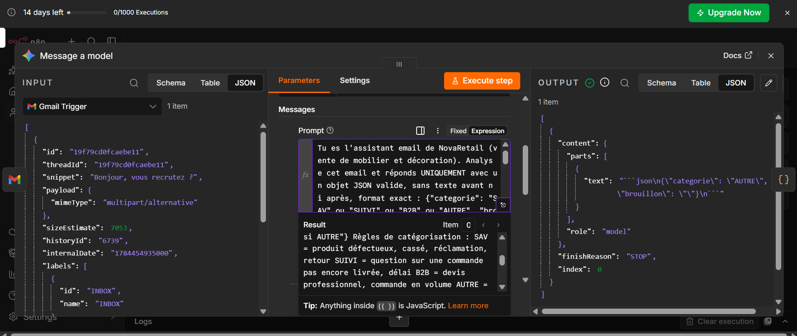
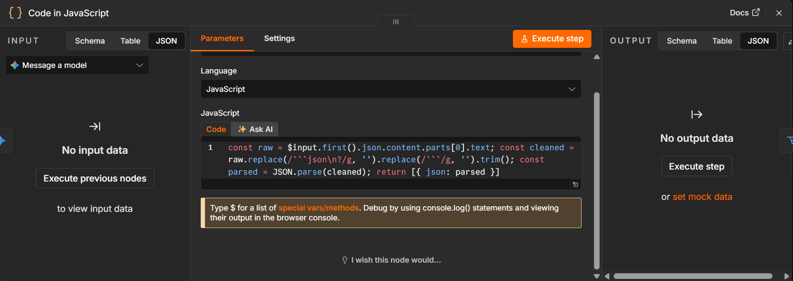
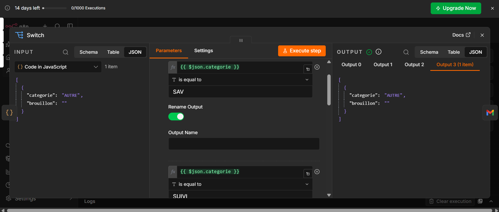
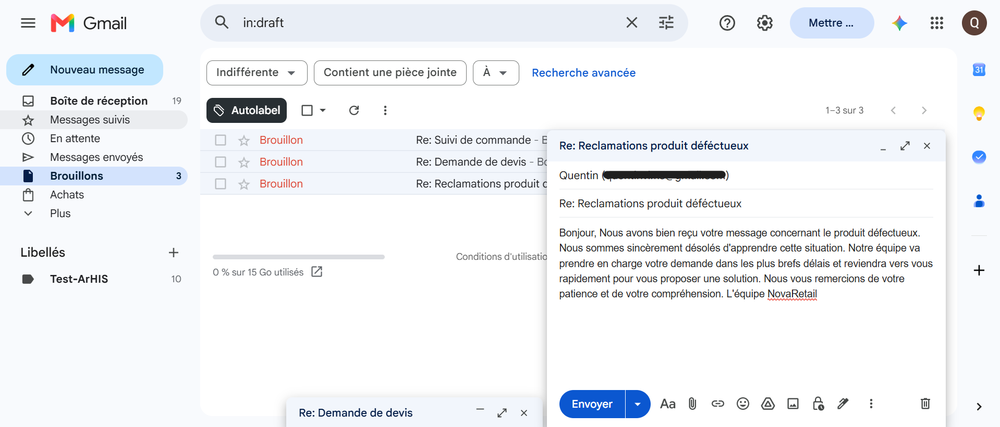

# NovaRetail Email Automation — n8n + Gemini AI + Gmail

Automated email triage and reply-drafting system for a fictional furniture retail SME (NovaRetail), built as part of a professional certification project (RS7311).

## What it does

Incoming customer emails are automatically classified into one of four categories, and a reply draft is generated for the three categories requiring a response. Drafts are saved directly into Gmail — **never sent automatically** — so a human always reviews and validates before anything goes out.

## Architecture

```
Gmail Trigger → Gemini (classification + draft, single call) → Code (JSON parsing) → Switch → Gmail Draft
```

- **Gmail Trigger**: polls the inbox for new incoming emails.
- **Gemini (gemini-2.5-flash)**: a single prompt both classifies the email (`SAV`, `SUIVI`, `B2B`, `AUTRE`) and, when relevant, drafts a professional reply — returned as structured JSON. Merging classification and drafting into one call avoids duplicating AI logic per category and keeps the "should we reply or not" decision in deterministic logic rather than in the model.
- **Code node**: strips markdown code fences from the model output and parses the JSON into clean fields (`categorie`, `brouillon`).
- **Switch**: routes based on `categorie`. `AUTRE` (spam / irrelevant) ends the flow with no action — a deliberate choice to avoid using AI where a simple rule already does the job.
- **Gmail Draft**: creates a draft addressed to the original sender, subject prefixed `Re:`, body from the generated `brouillon`, for the three actionable categories.

## What I learned

The initial version used `gemini-2.5-flash-lite` for classification, which produced inconsistent results on identical inputs — the same email was sometimes classified `SAV`, sometimes `AUTRE`. Switching to the standard `gemini-2.5-flash` model and fixing the temperature resolved the instability. A separate bug came from a field-naming mismatch after the Gmail Trigger's "Simplify" output format changed (`subject`/`text` vs `Subject`/`snippet`) — a reminder to always inspect the actual node input rather than assume a schema. The classification and drafting steps were also merged into a single AI call after realizing the first design (one Gemini node per category) unnecessarily duplicated the same logic three times.

## Stack

n8n (workflow orchestration) · Google Gemini API (classification + copywriting) · Gmail API (trigger + draft creation)

## Screenshots

**Full workflow**


**Gmail Trigger configuration**


**Gemini prompt — classification and drafting**


**Code node — JSON parsing**


**Switch — routing rules**


**Result — Gmail draft**


---

## Résumé (Français)

Système de tri et de rédaction automatique de brouillons d'emails pour NovaRetail, une TPE fictive de vente de mobilier. Chaque email entrant est classé (SAV, suivi de commande, demande B2B, ou hors-sujet) et un brouillon de réponse est généré pour les cas pertinents, toujours déposé en brouillon Gmail — jamais envoyé automatiquement, validation humaine systématique avant envoi.

## Resumen (Español)

Sistema de clasificación y redacción automática de borradores de correo para NovaRetail, una pyme ficticia de venta de mobiliario. Cada correo entrante se clasifica (SAV, seguimiento de pedido, solicitud B2B u otro) y se genera un borrador de respuesta para los casos pertinentes, guardado siempre como borrador en Gmail — nunca enviado automáticamente, con validación humana obligatoria antes del envío.
